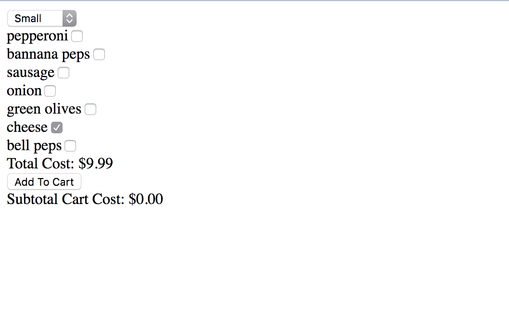

# Waldo's Pizza Shop

If you like Douglas Crockford's personal website, you are in for a treat. Waldo's Pizza Shop is a simple React/Redux application that allows you to add and remove pizzas of any size to a shopping cart. You can add toppings, but only the max for that particular size.

To get running locally clone this repo to your desktop with:
`git clone https://github.com/arecvlohe/waldos-pizza-shop.git`

Then run either `yarn install` or `npm install` to install dependencies.

Afterwards you should be able to run the application from the command line using `npm run dev`.

If you have any trouble or questions, please let me know!

Here is a sneak preview:

